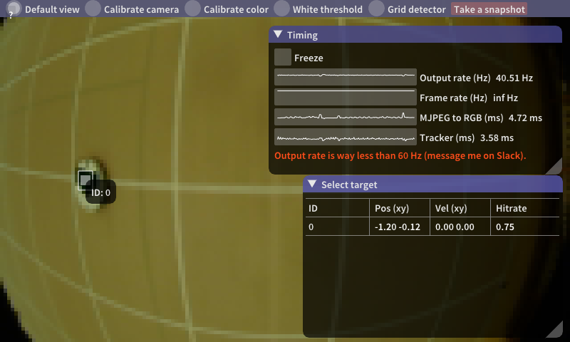

### About this repository

This repository contains the downward target tracker node, whose job it is to detect and track targets seen in the downward fisheye camera. It also contains the line counter node (see [README_linecounter.md](README_linecounter.md)), because it needs the fisheye camera video and thus shares it for efficiency. These will run on the drone.

It also contains a debugger, that you can run on your computer, to verify that target tracking works correctly, and calibrate camera parameters, algorithm parameters, etc. It does not need to run during the competition, and is intended only for calibration and verification before the competition.

The tracker, when running correctly, will publish a list of tracked targets, [msg/tracks.msg](msg/tracks.msg), 60 times per second on the topic ```TRACKS_TOPIC```, which you can change in [src/parameters.h](src/parameters.h). Each target has a unique ID that you can use to refer to it. The ID persists while the target is tracked. Targets stop being tracked if they are not seen two seconds. The message can be used like this:

```
downward_target_tracker::tracks msg // From callback
int selected_id = 1234; // From planning algorithm, or manual selection
// ...
for (int i = 0; i < msg.num_targets)
{
    int id = msg.unique_id[i];
    float x = msg.position_x[i];
    float y = msg.position_y[i];
    float vx = msg.velocity_x[i];
    float vy = msg.velocity_y[i];

    if (id == selected_id)
    {
        // publish x,y,vx,vy to velocity-feedforward controller node?
    }
}
```

The debugger can be used to *select* a target by clicking on its list row in the GUI, and have its ```unique_id``` published on the topic ```SELECTED_TOPIC```, which you can change in [src/parameters.h](src/parameters.h).

### Compiling

Get the video 4 linux 2 development libraries (v4l2)
```
$ sudo apt-get install libv4l-dev
$ sudo apt-get install v4l-utils
```

Get the turbojpeg library (see [libjpeg-turbo/BUILDING.md](https://github.com/libjpeg-turbo/libjpeg-turbo/blob/master/BUILDING.md))
```
$ git clone https://github.com/libjpeg-turbo/libjpeg-turbo
$ cd libjpeg-turbo
$ autoreconf -fiv
$ mkdir build
$ cd build
$ sh ../configure
$ make
$ make install prefix=/usr/local libdir=/usr/local/lib64
```

Get SDL2 (for the debugger)
```
$ sudo apt-get install libsdl2-dev
```

Clone [ascend_msgs](https://github.com/AscendNTNU/ascend_msgs) into catkin workspace.

If you are building the project on a Jetson TX2(or any other machines without Intel SSE support) you will have to do the following two steps to build the downward tracker:
1. Remove the parameter `-mavx` in [CMakeLists.txt](CMakeLists.txt).
2. Change `#define USE_SSE 1` to `#define USE_SSE 0` in [src/parameters.h](src/parameters.h).

Run the following command to build the node:
```
catkin_make
```

The debugger is only built if SDL2 is present on the system.

### Running the tracker and debugger

1. (On drone) Set camera device path and drone pose topic in [src/parameters.h](src/parameters.h)
2. (On drone) Start tracker: ```$ rosrun downward_target_tracker tracker```
3. (On pc) Connect to drone ROS: ```$ export ROS_MASTER_URI=http://192.168.1.151:11311```
(IP is an example, replace with drone's IP. Port must be 11311).
4. (On pc) Start debugger: ```$ rosrun downward_target_tracker debugger```

### Verify that grid detection works

1. Verify that the rotation and translation is interpreted correctly by the grid detector, by following the calibration guide in [README_example_calibration.md](README_example_calibration.md).

2. Adjust camera exposure to fit the lighting: by running the [set_camera_controls.sh](/set_camera_controls.sh) script on the drone while the tracker is running. It will set the camera exposure, gain, powerline frequency, etc., to values that are hardcoded in the script. Change the values in the script to get good image brightness, making sure that ```Frame rate``` stays at 60 Hz (see Timing window in debugger).

3. Click the *White threshold* tab in the debugger and adjust the values until the white grid lines are clearly visible, and that the background is clean (not noisy).

4. Go to the *Grid detector* tab and check that the detected grid aligns with the real grid. Adjust white thresholds, detector parameters, or camera calibration otherwise.

### Verify that tracking works

1. Look at the *Default view* tab in the debugger.
2. Look at a target (red or green plate)
3. Stand one meter above the ground without tilting, or be publishing the drone pose

You should see the camera feed, a list of targets, and bounding boxes around each, as illustrated below. If not, we need to calibrate color thresholds. To do this, click the *Calibrate color* tab and follow the guide that shows up, or click the *Take a snapshot* button and send the files (snapshot*.jpg snapshot*.txt created in the directory you ran the debugger) to me. Save the parameters by editing [src/parameters.h](src/parameters.h) on the drone, and recompiling.



### Description of all parameters

Parameter   | What
------------|-----
DEVICE_NAME         | i.e. /dev/video1
USE_CAMERA_NODE     | Set to 1 if camera input is from an external camera node, 0 otherwise.
USE_SSE             | Set to 1 if you want to use a SIMD optimized version of the grid detector. Should be set to 0 if the grid detector is used on a computer without Intel SSE support.
USE_TRACKER             | Set to 1 if you want to use the built-in ground robot tracker
IMU_POSE_TOPIC      | Topic for best current estimate of drone pose (geometry_msgs::PoseStamped)
TRACKS_TOPIC        | Topic on which list of targets will be published (tracks.msg)
IMAGE_TOPIC         | Topic on which compressed camera feed will be published (image.msg)
INFO_TOPIC          | Topic on which debug info (adjustable parameters, bounding boxes and detections) will be published 
CAMERA_TOPIC        | Topic on which camera node that we get input from. The images must be published as compressed JPEGs.
LINE_COUNTER_TOPIC  | Topic on which [line counter output](README_linecounter.md) will be published
SELECTED_TOPIC      | Topic on which selected target ID will be published (std_msgs::Int32)
INFO_PUBLISH_INTERVAL | Change this to limit how often debug visualization info is sent (default is every frame)
IMAGE_PUBLISH_INTERVAL | Change this to limit how often compressed camera image is sent (default is every frame)
CAM_IMU_RX/Y/Z_INIT | Euler angles defining rotation from camera coordinates to imu coordinates
CAM_IMU_TX/Y/Z_INIT | Camera center relative imu center in imu coordinates
R_G/B/N_INIT | Color thresholds for 'red' classification (minimum red/green ratio, minimum red/blue ratio, and minimum average brightness)
G_R/B/N_INIT | Color thresholds for 'green' classification (minimum green/red ratio, minimum green/blue ratio, and minimum average brightness)
CAMERA_WIDTH/HEIGHT | Request video resolution from USB camera
CAMERA_BUFFERS | This might need to be changed if "Frame rate" (see Timing window in debugger) is less than 60 Hz
CAMERA_LEVELS | How many halvings of resolution should be done
CAMERA_F/U0/V0_INIT | Fisheye projection parameters, depends on video resolution
