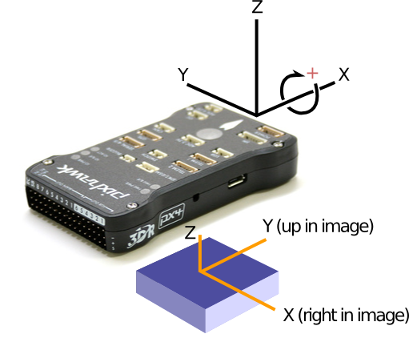

#### Example of extrinsic calibration

**Rotation:**

To make your life easy, you want to mount the downward camera in the same **plane** as the x and y axes of the pixhawk (in mavros ENU convention): so that the only difference between the coordinate frames of the camera, and that of the pixhawk, is a rotation about the z axis.

To illustrate, the picture below shows

1. what we will refer to as the *IMU coordinate frame*, which is attached (somewhere) on the drone with the x-axis pointing along the white pixhawk arrow
2. what we will refer to as the *CAM coordinate frame*, which is attached to the camera



If mounted as shown, the y-axis of the camera (which goes **upward** in the image that you see in the debugger) is aligned with the x-axis of the drone; and the x-axis of the camera (which goes **right** in the image) is aligned with the negative y-axis.

This corresponds to saying that the CAM frame is rotated -90 degrees along z with respect to the IMU frame. This can be specified in [src/parameters.h](src/parameters.h) by setting

```
#define CAM_IMU_RX_INIT (0)
#define CAM_IMU_RY_INIT (0)
#define CAM_IMU_RZ_INIT (-3.14/2.0f)
```

**Translation:**

This is kinda tricky, because I don't know where the origin of the IMU frame is. But, to illustrate how it works, consider the image above (and forgive the confusing 3D). Then, with respect to the IMU frame, the camera frame is translated (1) negative value in x, (2) zero value in y (although not so evident in the image), (3) a negative value in z. This can be specified in  [src/parameters.h](src/parameters.h) by setting (with example values)
```
#define CAM_IMU_TX_INIT (-2.0f/100.0f) // -2 centimeters
#define CAM_IMU_TY_INIT (0.0f)
#define CAM_IMU_TZ_INIT (-5.0f/100.0f) // -5 centimeters
```

Together with rotation, these parameters describe the **extrinsic** camera calibration.

**Calibration procedure:**

The "Camera calibration" tab in the debugger will overlay a 3D grid pattern on the camera feed based on the given extrinsic and intrinsic calibration parameters, and the current pose of the IMU frame relative to the calibration pattern.

If you are publishing on ```IMU_POSE_TOPIC```, you can have the pose of the IMU be set automatically to that, with the option to select a subset of the parameters (i.e. only pitch and roll) and specify the rest manually.

They can be specified by adjusting *tx, ty, tz* under *Drone origin relative grid origin in grid coordinates* in the *Calibration* window, and *rx, ry, rz* under *Drone frame relative grid frame*. Untick the checkbox of those you want to be set to the published IMU pose.

The extrinsic calibration parameters can be specified by adjusting *tx, ty, tz* and *rx, ry, rz* under *Camera extrinsics* in the *Parameters* window. These correspond to ```CAM_IMU_TX_INIT```, ... etc., above.

To verify that the extrinsic calibration is correct, follow these steps:

1. Look at a grid pattern (i.e. 1x1m grid carpet, or a small checkerboard on your phone)
2. Set the pattern dimensions (cell width) in the *Calibration* window
3. Keep the drone flat with the pattern
4. Align the IMU x-axis with (any of) the lines in the pattern
5. Adjust height manually, or ensure that published height is correct, by comparing the size of the tiles in the visualized grid with the image. If they do not coincide, adjust *tz* under *Drone origin relative grid origin in grid coordinates* in the *Calibration* window.
6. You probably also want to align the x and y position relative to the grid origin, which you need to do manually unless you somehow measure that and publish it on ```IMU_POSE_TOPIC```. Adjust *tx* and *ty* in the same window.

The visualized grid should now coincide with the true grid in the image. If not, or if you think the extrinsic values are suspicious, then the intrinsic calibration might be wrong. Send me a snapshot if that is the case.

To verify extrinsic rotation:

6. Tilt the IMU positively around its x-axis (arrow in picture above). If you are publishing on ```IMU_POSE_TOPIC```, ensure that I've got my coordinate conventions correct by checking that the resulting *rx* under *Drone frame relative grid frame*, is also positive. Do the same for around the y-axis.

If you got your extrinsic rz right, the visualized grid should rotate to always coincide with the grid on the ground.
